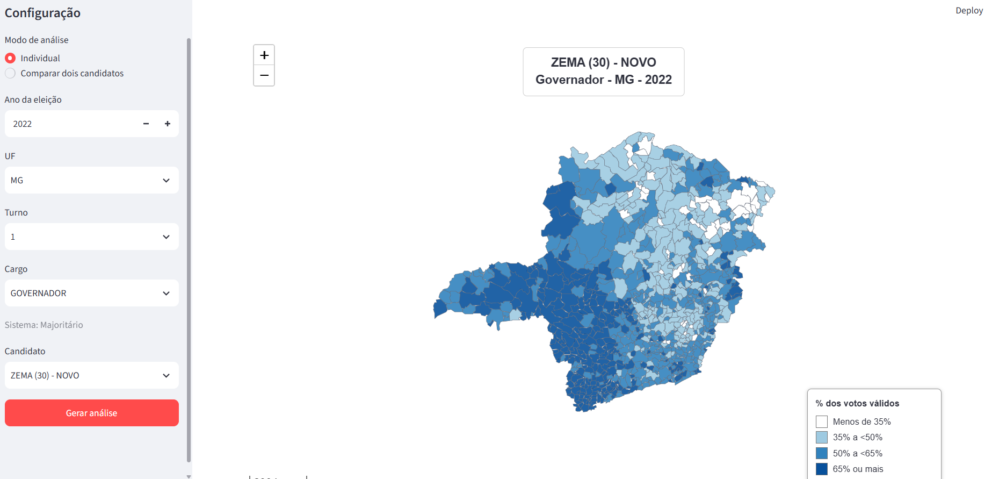
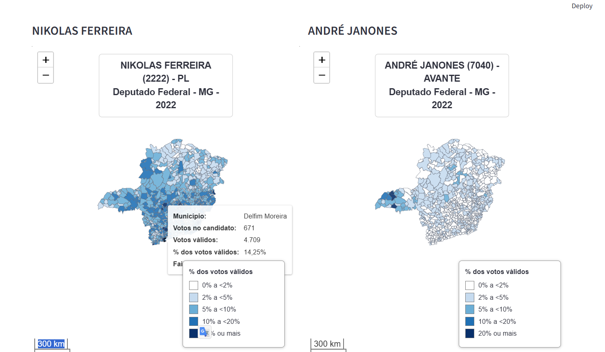
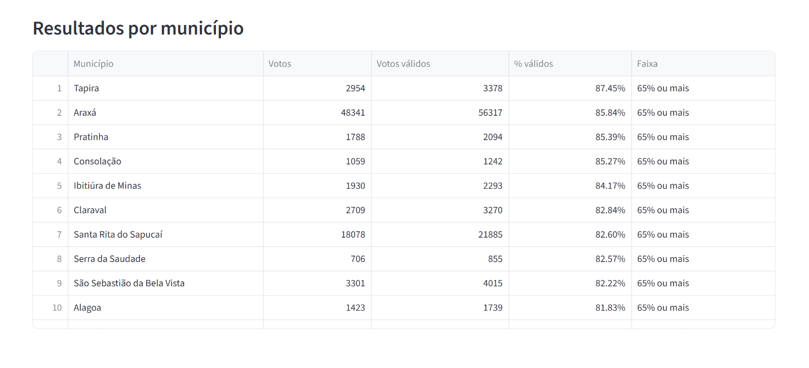

# 🗳️ Análise Geográfica de Resultados Eleitorais

Aplicação de dados para exploração geográfica de resultados eleitorais brasileiros, combinando dados oficiais do Tribunal Superior Eleitoral (TSE), malhas municipais do IBGE, processamento em Python, armazenamento em Parquet e visualização interativa com Streamlit e Folium.

O projeto permite selecionar eleições, cargos e candidatos e analisar como a votação se distribui territorialmente entre os municípios.

Além da visualização individual, a aplicação permite comparar candidatos e gerar rankings municipais a partir da participação de cada candidato nos votos válidos.

---

## 📌 Objetivo

O projeto nasceu de uma pergunta simples:

> Como visualizar, de forma rápida e intuitiva, onde determinado candidato teve maior ou menor participação eleitoral?

Os arquivos eleitorais disponibilizados pelo TSE possuem grande volume de registros e são estruturados principalmente para análise tabular.

O objetivo deste projeto foi construir uma pipeline capaz de:

1. baixar os arquivos oficiais;
2. tratar grandes arquivos eleitorais;
3. agregar resultados por município;
4. integrar os códigos municipais do TSE aos códigos do IBGE;
5. associar resultados eleitorais às geometrias municipais;
6. armazenar os dados tratados em formato otimizado;
7. disponibilizar consultas interativas por meio de uma aplicação web.

---

# 🖥️ Aplicação

A interface foi construída com **Streamlit** e os mapas interativos com **Folium / Leaflet**.

O usuário pode selecionar:

- ano da eleição;
- unidade da Federação;
- cargo;
- turno;
- candidato.

A aplicação calcula automaticamente a participação do candidato nos votos válidos de cada município.

---

## 🗺️ Mapa individual

O mapa individual mostra a distribuição territorial da votação de um candidato.



Cada município apresenta informações como:

- nome do município;
- votos recebidos pelo candidato;
- total de votos válidos;
- percentual do candidato;
- faixa percentual correspondente.

---

## 🔄 Comparação entre candidatos

A aplicação também permite selecionar dois candidatos e comparar sua distribuição territorial.



A comparação facilita a identificação de diferenças geográficas entre candidaturas dentro da mesma eleição.

---

## 📊 Ranking municipal

Além do mapa, os resultados podem ser ordenados pela participação percentual do candidato em cada município.



Isso permite identificar rapidamente os municípios em que determinada candidatura apresentou maior ou menor concentração relativa de votos.

---

# 🎨 Classificação visual

Para facilitar a interpretação cartográfica, os percentuais são agrupados em faixas.

## Cargos proporcionais

Utilizados para cargos como:

- Deputado Federal;
- Deputado Estadual;
- Deputado Distrital;
- Vereador.

Faixas utilizadas:

| Participação nos votos válidos | Representação |
|---|---|
| 0% a < 2% | Branco |
| 2% a < 5% | Azul muito claro |
| 5% a < 10% | Azul claro |
| 10% a < 20% | Azul intermediário |
| ≥ 20% | Azul escuro |

## Cargos majoritários

Utilizados para cargos como:

- Presidente;
- Governador;
- Senador;
- Prefeito.

Faixas utilizadas:

| Participação nos votos válidos | Representação |
|---|---|
| < 35% | Branco |
| 35% a < 50% | Azul claro |
| 50% a < 65% | Azul intermediário |
| ≥ 65% | Azul escuro |

> Essas faixas são exclusivamente critérios analíticos e visuais definidos para o projeto. Não representam regras, limites ou classificações da legislação eleitoral.

---

# 🏗️ Arquitetura

A aplicação foi organizada em diferentes etapas de processamento.

```text
                         FONTES
                           │
                ┌──────────┴──────────┐
                │                     │
               TSE                   IBGE
                │                     │
        resultados eleitorais     geometrias
                │                     │
                └──────────┬──────────┘
                           │
                    Download / ingestão
                           │
                           ▼
                   Arquivos históricos
                         ZIP / CSV
                           │
                           ▼
                    Transformação
                         Python
                           │
                           ▼
                  Silver local
                       Parquet
                           │
                           ▼
             Integração TSE ↔ IBGE
                           │
                           ▼
                  Dados analíticos
                           │
                           ▼
                Streamlit + Folium
                           │
                           ▼
                  Mapa interativo
```

---

# ⚡ Otimização de desempenho

A primeira versão da aplicação processava diretamente os grandes arquivos CSV disponibilizados pelo TSE.

O fluxo era aproximadamente:

```text
ZIP
 ↓
CSV
 ↓
leitura de milhões de registros
 ↓
filtro por candidato
 ↓
agregação por município
 ↓
mapa
```

Embora funcional, esse processo fazia com que a primeira consulta de cada candidato fosse relativamente lenta.

A arquitetura foi então modificada para utilizar **Apache Parquet** como camada intermediária.

O fluxo atual é:

```text
ZIP do TSE
     ↓
processamento único
     ↓
agregação por município
     ↓
Parquet particionado
     ↓
consulta do candidato
     ↓
mapa
```

Os dados são particionados principalmente por:

```text
ano
UF
cargo
```

Exemplo:

```text
data/parquet/
└── votacao_candidato_municipio/
    └── ano=2022/
        └── uf=MG/
            └── cargo=DEPUTADO_FEDERAL/
                └── dados.parquet
```

Dessa forma, a aplicação não precisa mais percorrer todo o arquivo eleitoral original sempre que um candidato é consultado.

---

# 🧱 Camadas de dados

A organização dos dados segue conceitualmente uma arquitetura em camadas.

## Raw / Bronze

Arquivos originais obtidos das fontes oficiais.

```text
data/tse_historico/
```

Exemplos:

```text
consulta_cand_2022.zip

votacao_candidato_munzona_2022.zip

detalhe_votacao_munzona_2022.zip
```

---

## Silver local

Dados tratados e armazenados em Parquet.

```text
data/parquet/
```

Principais datasets:

```text
candidatos/

votacao_candidato_municipio/

apuracao_municipio/
```

Nesta etapa são realizadas operações como:

- padronização de campos;
- conversão de tipos;
- seleção de colunas;
- agregação das zonas eleitorais;
- consolidação por candidato e município;
- consolidação dos votos válidos;
- criação de partições.

---

## Processed

Resultados específicos já produzidos pela aplicação podem ser armazenados em:

```text
data/processed/
```

Essa camada funciona como cache adicional para determinadas consultas.

---

# ☁️ Evolução para Lakehouse

O projeto também possui uma implementação experimental utilizando **Databricks**.

A arquitetura planejada segue o padrão Medallion:

```text
                    Databricks
                        │
             ┌──────────┴──────────┐
             │                     │
          Bronze                 Silver
       dados originais       dados tratados
             │                     │
             └──────────┬──────────┘
                        │
                       Gold
                        │
              dados prontos para
                  aplicação
                        │
                 SQL Warehouse
                        │
                    Streamlit
```

Estrutura criada:

```text
politica
├── bronze
├── silver
└── gold
```

Exemplos de tabelas:

```text
politica.bronze.votacao_candidato

politica.bronze.apuracao

politica.silver.votacao_candidato_municipio

politica.silver.apuracao_municipio

politica.gold.resultado_candidato_municipio

politica.gold.dim_candidatos
```

A versão cloud está sendo utilizada como evolução do projeto local e como estudo de:

- Apache Spark;
- PySpark;
- Delta Lake;
- arquitetura Medallion;
- Unity Catalog;
- SQL Warehouse;
- engenharia de dados em ambiente Lakehouse.

---

# 📦 Dados eleitorais

O projeto foi estruturado para trabalhar com eleições brasileiras desde 2014.

Anos considerados:

```text
2014
2016
2018
2020
2022
2024
```

Isso permite trabalhar tanto com eleições gerais quanto municipais.

Entre os cargos contemplados pela arquitetura estão:

```text
Presidente

Governador

Senador

Deputado Federal

Deputado Estadual

Deputado Distrital

Prefeito

Vereador
```

A disponibilidade efetiva de cada cargo depende naturalmente do tipo de eleição realizada em cada ano.

---

# 🔗 Integração TSE ↔ IBGE

Um dos desafios do projeto é que TSE e IBGE utilizam identificadores municipais próprios.

A aplicação utiliza uma tabela de correspondência para realizar:

```text
Código municipal TSE
        ↓
Código municipal IBGE
        ↓
Geometria do município
```

O código IBGE passa a funcionar como chave para integrar os resultados eleitorais à malha geográfica.

---

# 🌎 Dados geográficos

As geometrias municipais são obtidas a partir dos serviços de dados geográficos do IBGE.

O pipeline:

```text
IBGE
  ↓
GeoJSON
  ↓
GeoPandas
  ↓
normalização de CRS
  ↓
integração com resultados eleitorais
  ↓
Folium
```

As geometrias são mantidas separadas dos grandes datasets eleitorais para evitar transferências e leituras desnecessárias.

---

# 📐 Métrica principal

A métrica utilizada para representar a força relativa de um candidato em um município é:

```text
                     votos do candidato
percentual = -------------------------------- × 100
                     votos válidos do cargo
```

Isso permite comparar municípios de tamanhos populacionais muito diferentes.

Um município pequeno e um município grande podem ser comparados pela proporção dos votos, e não apenas pelo número absoluto de votos recebidos.

---

# 🧪 Validação dos dados

Durante o desenvolvimento foram realizadas validações entre os dados brutos e os datasets tratados.

Entre as verificações realizadas:

- quantidade de municípios;
- soma total de votos do candidato;
- soma de votos válidos;
- correspondência entre códigos TSE e IBGE;
- identificação de geometrias ausentes;
- comparação entre processamento CSV e Parquet;
- conferência dos resultados após agregação das zonas eleitorais.

O objetivo é garantir que as otimizações de armazenamento não alterem os valores originais.

---

# 🛠️ Tecnologias

## Linguagem

```text
Python
```

## Manipulação de dados

```text
Pandas
PyArrow
GeoPandas
```

## Visualização

```text
Folium
Leaflet
Streamlit
streamlit-folium
```

## Armazenamento

```text
CSV
ZIP
Apache Parquet
Delta Lake
```

## Engenharia de dados

```text
Databricks
PySpark
Spark SQL
Unity Catalog
SQL Warehouse
```

## Outras ferramentas

```text
Git
GitHub
VS Code
Jupyter
PowerShell
```

---

# 📁 Estrutura do projeto

```text
politica/
│
├── data/
│   ├── parquet/
│   ├── processed/
│   ├── raw/
│   ├── interim/
│   └── tse_historico/
│
├── docs/
│   └── screenshots/
│       ├── mapa_individual.png
│       ├── comparacao_candidatos.png
│       └── ranking_municipal.png
│
├── outputs/
│
├── scripts/
│   ├── converter_tse_parquet.py
│   └── download_tse_historico.py
│
├── src/
│   ├── __init__.py
│   ├── config.py
│   ├── databricks_client.py
│   ├── election.py
│   ├── extract.py
│   ├── transform.py
│   ├── tse.py
│   └── visualize.py
│
├── app.py
├── run_pipeline.py
├── requirements.txt
├── README.md
└── .gitignore
```

Os grandes arquivos de dados não são versionados no Git.

---

# 🚀 Instalação

Clone o repositório:

```bash
git clone https://github.com/GabrielMendes84/mapa-eleitoral.git
```

Entre na pasta:

```bash
cd politica
```

Crie um ambiente virtual:

```bash
python -m venv .venv
```

No Windows PowerShell:

```powershell
.\.venv\Scripts\Activate.ps1
```

Instale as dependências:

```bash
python -m pip install -r requirements.txt
```

---

# 📥 Download dos dados históricos

O script:

```text
scripts/download_tse_historico.py
```

automatiza o download dos arquivos eleitorais necessários.

Execute:

```bash
python scripts/download_tse_historico.py
```

Os arquivos são organizados por eleição:

```text
data/tse_historico/
├── 2014/
├── 2016/
├── 2018/
├── 2020/
├── 2022/
├── 2024/
└── apoio/
```

O script:

- ignora arquivos já existentes;
- valida os ZIPs;
- suporta retomada;
- utiliza fallback de download quando necessário.

---

# ⚙️ Conversão para Parquet

Depois do download, os dados podem ser convertidos para a camada Silver local:

```bash
python scripts/converter_tse_parquet.py
```

Para processar apenas uma eleição:

```bash
python scripts/converter_tse_parquet.py --anos 2022
```

Para processar apenas determinada UF:

```bash
python scripts/converter_tse_parquet.py --anos 2022 --ufs MG
```

Ou várias UFs:

```bash
python scripts/converter_tse_parquet.py --anos 2022 --ufs MG,SP,RJ
```

Partições concluídas recebem um marcador:

```text
_SUCCESS
```

Assim, uma nova execução não precisa refazer partições já processadas.

---

# ▶️ Executando a aplicação

Com o ambiente virtual ativo:

```bash
python -m streamlit run app.py
```

O navegador abrirá a interface da aplicação.

---

# 🔄 Estratégia de leitura

O backend procura os dados seguindo uma estratégia de fallback:

```text
1. Parquet tratado
       ↓
2. ZIP histórico local
       ↓
3. Download da fonte
```

Isso permite combinar desempenho com reprodutibilidade.

---

# 🎯 Principais desafios técnicos

Durante o desenvolvimento foram trabalhados problemas típicos de projetos reais de dados:

### Grandes volumes de dados

Os arquivos eleitorais podem possuir milhões de registros.

A solução adotada inclui:

```text
chunk processing
+
agregação antecipada
+
Parquet
+
particionamento
```

### Diferentes identificadores municipais

TSE e IBGE utilizam códigos diferentes.

Foi necessário criar uma etapa específica de integração entre os datasets.

### Dados geográficos

Resultados tabulares precisaram ser combinados com geometrias municipais para permitir análises espaciais.

### Performance da aplicação

O processamento sob demanda de arquivos CSV foi substituído progressivamente por dados pré-processados e armazenamento colunar.

### Compatibilidade entre eleições

A estrutura foi projetada para lidar com eleições gerais e municipais realizadas em diferentes anos.

---

# 📚 O que este projeto demonstra

Este projeto reúne competências de diferentes áreas de dados.

## Data Analysis

- construção de indicadores;
- análise territorial;
- comparação entre candidatos;
- ranking municipal;
- exploração de resultados eleitorais.

## Data Engineering

- ingestão de dados públicos;
- processamento de grandes arquivos;
- pipelines;
- particionamento;
- armazenamento colunar;
- Parquet;
- Delta Lake;
- arquitetura Medallion.

## Geospatial Data

- GeoJSON;
- GeoPandas;
- sistemas de coordenadas;
- integração entre dados tabulares e espaciais;
- mapas interativos.

## Software / Data Products

- aplicação web;
- organização modular do código;
- cache;
- separação entre backend e visualização;
- Streamlit;
- integração futura com SQL Warehouse.

---

# 🧭 Roadmap

Possíveis evoluções do projeto:

- [x] mapa individual de candidatos;
- [x] comparação entre candidatos;
- [x] ranking municipal;
- [x] download automatizado de dados;
- [x] armazenamento em Parquet;
- [x] particionamento por eleição, UF e cargo;
- [x] integração TSE ↔ IBGE;
- [x] protótipo de arquitetura Medallion no Databricks;
- [ ] integração definitiva Streamlit ↔ SQL Warehouse;
- [ ] carga histórica completa no Delta Lake;
- [ ] deploy da aplicação;
- [ ] análise por local de votação;
- [ ] análise por seção eleitoral;
- [ ] novas visualizações de evolução temporal;
- [ ] comparação do desempenho territorial entre eleições.

---

# ⚠️ Observações

Este projeto possui finalidade analítica, educacional e de portfólio.

Os resultados exibidos são derivados de dados públicos oficiais e não representam avaliação, recomendação ou posicionamento político sobre candidatos, partidos ou eleições.

As categorias de cores e faixas percentuais foram definidas exclusivamente para facilitar a leitura dos mapas.

---

# 📄 Fontes de dados

Principais fontes utilizadas:

- Tribunal Superior Eleitoral — Portal de Dados Abertos;
- Instituto Brasileiro de Geografia e Estatística — APIs de localidades e malhas territoriais;
- tabela de correspondência de códigos municipais TSE ↔ IBGE.

Os dados eleitorais originais não são armazenados no repositório Git devido ao seu volume.

---

# 👨‍💻 Autor

Projeto desenvolvido como estudo aplicado de:

**Análise de Dados, Ciência de Dados, Engenharia de Dados e visualização geográfica.**